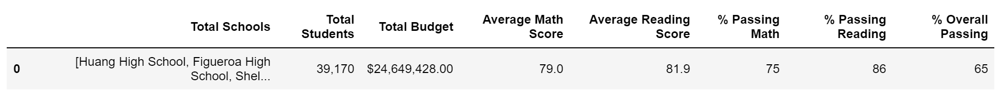
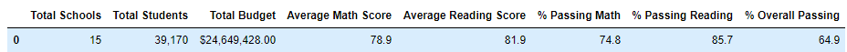
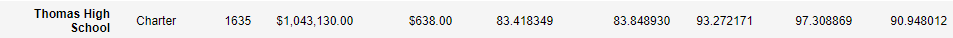
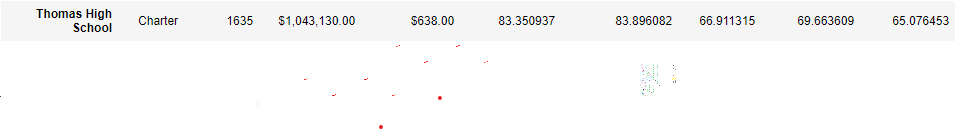
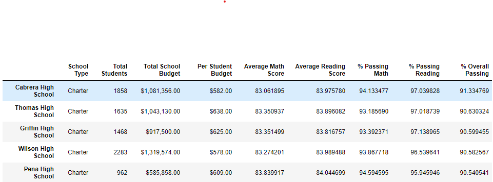

# School District Analysis

## Overview
The purpose of this analysis was to edit the original outcomes of a district analysis because of academic dishonesty. The school board has requested that a new analysis be prepared without the ninth grade reading and math scores from Thomas High School.

## Results
- District Summary
  - The district summary is not affected very much when the ninth grade scores from Thomas High School (THS) are removed
  - Before ninth grade scores from THS were removed: 
  - After ninth grade scores from THS were removed: 

- School Summary
  - The school summary for all of the schools except THS stay the same as their numbers have not been altered
  - The summary for THS is only slightly affected. When dropping the ninth graders' grades, we see a slight decrease in the percentage passing math, reading, and math and reading
  - Before ninth grade scores were removed: 
  - After ninth grade scores were removed: 

- Relative to Other Schools
  - Before and after removing the ninth graders' scores, THS's position in the highest performing schools does not change. In both instances, THS is the second-highest performing school in the district.

- More Affects
   - When removing THS's ninth grade scores, we see very minimal changes. Scores by school spending, size, and type all stay very similar if not identical. Math and reading scores    by grades are only affected by seeing "NaN" when running the report.

## Summary
Overall, removing the ninth grade scores of Thomas High School did not affect much of the overall data. There was a slight drop in the school district summary, but not an alarming dip. However, if the scores were left in as "NaN" instead of removed from the dataset entirely, we would have seen a much more drastic change. Because this would have altered the data unfairly, it was a good decision to remove them completely. The school district does not need to be concerned about the changes in the summary after removing THS's ninth grade scores because there was such a minimal change in them.
